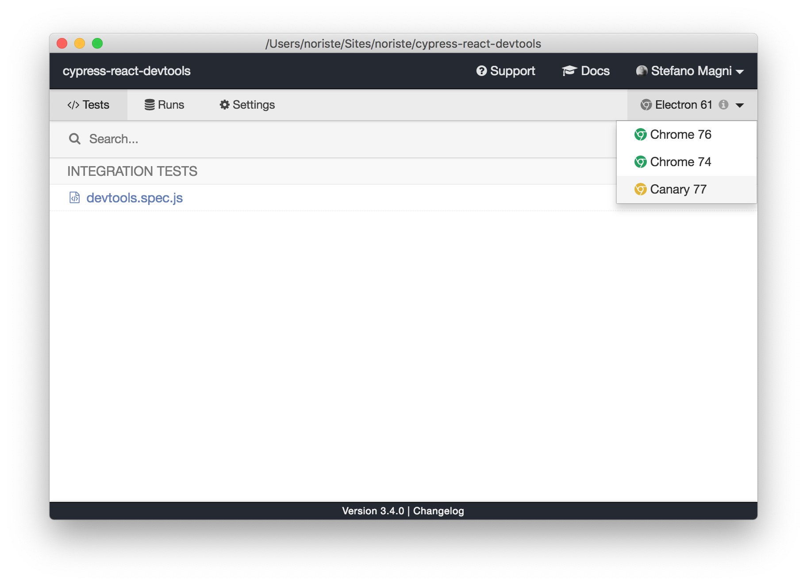
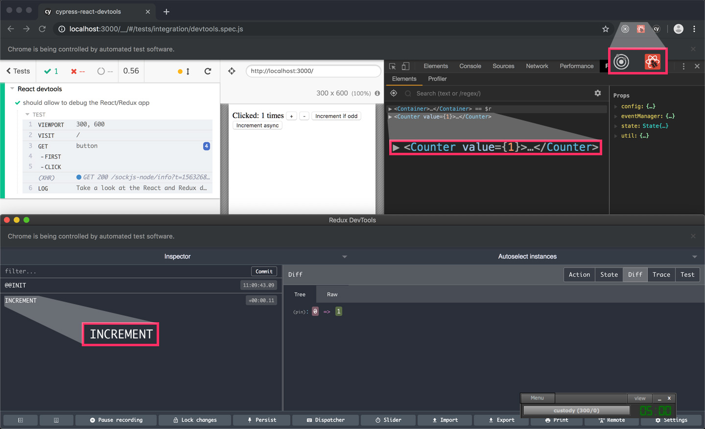

# cypress-react-devtools

A working React+Redux app to easily (but **MANUALLY**) verify if the React devtools are working with the Cypress-controlled browser.

### Why?

Cypress is an amazing tool and it can be leveraged even as a development tool, not only as a testing tool (read the [Use your testing tool as your primary development tool](https://github.com/NoriSte/ui-testing-best-practices/blob/master/sections/generic-best-practices/use-your-testing-tool-as-your-primary-development-tool.md) article).

To do that, the existing devtool must work with the Cypress-controlled browser too (see the [Support React Dev Tools issue](https://github.com/bahmutov/cypress-react-unit-test/issues/15)). This application allows you to easily check that the React devtools work as expected.

### Usage

- clone the repository
- launch `npm install`
- launch `npm start`
- in a dedicated terminal tab, launch `npm run cy:open`
- in the Cypress UI, choose a Chrome instance with the React and Redux devtools installed (see the [Chrome instance screenshot](#chrome-instance-screenshot))
- open the devtools and check that they work (see the [Working devtool screenshot](#working-devtools-screenshot))

### Screenshots
#### Chrome instance screenshot

#### Working devtools screenshot

## Contributors

Thanks goes to these wonderful people ([emoji key](https://allcontributors.org/docs/en/emoji-key)):

<!-- ALL-CONTRIBUTORS-LIST:START - Do not remove or modify this section -->
<!-- prettier-ignore -->
<table><tr><td align="center"><a href="https://twitter.com/NoriSte"> <b>Stefano Magni</b></a> <a href="https://github.com/NoriSte/cypress-react-devtools/commits?author=NoriSte" title="Code">💻</a> <a href="https://github.com/NoriSte/cypress-react-devtools/commits?author=NoriSte" title="Documentation">📖</a></td></tr></table>

<!-- ALL-CONTRIBUTORS-LIST:END -->

This project follows the [all-contributors](https://github.com/all-contributors/all-contributors) specification. Contributions of any kind welcome!
